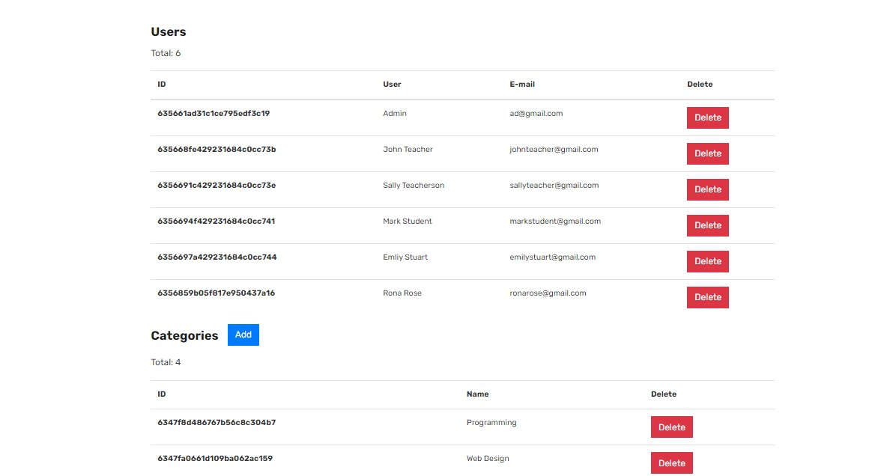
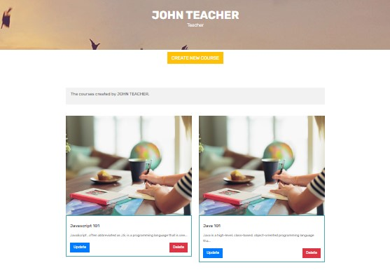
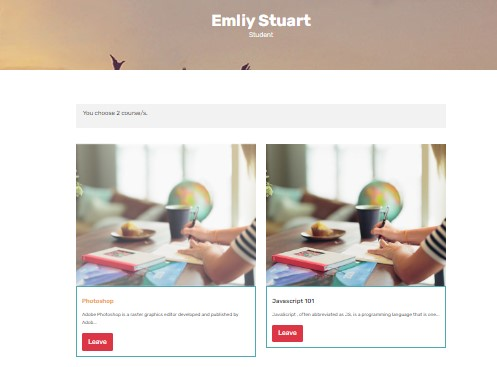
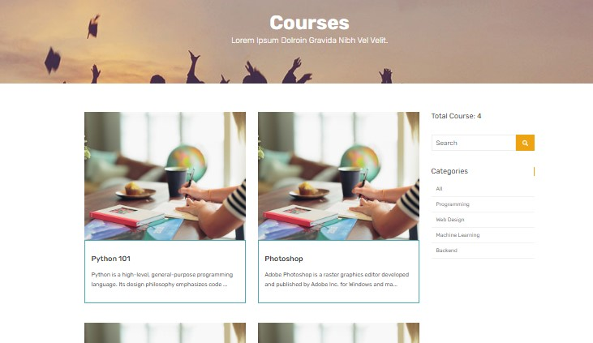
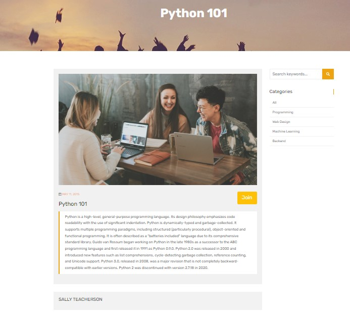

# Clean Blog

## Project Information

This is a Node.js backend project. This includes express.js, method-override and mongoose as dependencies. The template is taken from html.design. The development dependency is Nodemon.

`npm i express method-override mongoose connect-mongo connect-flash bcrypt express-session express-validator node-mailer slugify`

 

## Deployment

MongoDB Atlas is used as the database cloud. For hosting, the project is pushed Heroku.

https://smarteduportalkoc.herokuapp.com/
  

This project includes teacher, student and admin page. Only teachers can create a course. Students are not authorized to create a course. Admin can create categories for courses.

When a student joins a course, that course is listed on the student's dashboard page. Likewise when a teacher creates a course, that course is listed on the teacher's dashboard page.

Admin can control users and categories. Creates categories and removes users and categories. When admin removes a user with the teacher role, course created by that teacher is removed.

Respectively admin, teacher, student, courses, single course pages.

